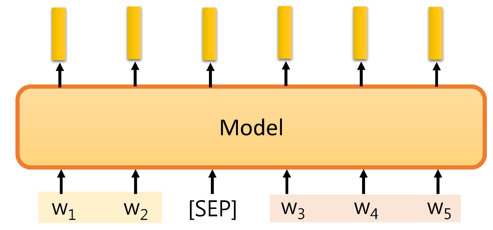

# 0. Top conferences in Natural Language Processing
- [*dblp: computer science bibliography](https://dblp.uni-trier.de/db/conf/)

- [ACL: Association for Computational Linguistics](https://www.aclweb.org/portal/acl)
- [EMNLP: Empirical Methods in Natural Language Processing](https://www.aclweb.org/portal/emnlp)
- [NAACL: North American Chapter of the Association for Computational Linguistics](http://naacl.org/)
- [EACL: European Chapter of the Association for Computational Linguistics](http://www.eacl.org/)
- [COLING: International Conference on Computational Linguistics](https://coling2020.org/)
- [CoNLL: Conference on Natural Language Learning](https://www.conll.org/)

- [ICML: International Conference on Machine Learning](https://icml.cc/)
- [NeurIPS: Neural Information Processing Systems](https://nips.cc/)
- [AAAI: Association for the Advancement of Artificial Intelligence](https://www.aaai.org/)
- [SIGIR: Special Interest Group on Information Retrieval](http://sigir.org/)
- [LREC: Language Resources and Evaluation](http://lrec-conf.org/)


# 1. Overview of NLP Tasks

总体而言，**自然语言处理**（Natural Language Processing）应涉及所有以人类的**语音**和**文字**为处理对象的研究，但是此处我们仅考虑针对**文本处理**的研究内容。

根据语言模型输入和输出类型的不同，现有的NLP 任务大致可以分为以下类别：


(Source from: [Deep learning course by Hung-yi Lee](http://speech.ee.ntu.edu.tw/~tlkagk/courses/DLHLP20/TaskShort%20(v9).pdf))

## 1.1 Part-of-Speech Tagging (POS)
- `Input`: Sequence.
- `output`: Class for each token.

为文本中的每一个Token标注**词性**（动词、形容词、名词等），尤其是对于**一词多义**的情况较为重要，见下例：
```
John saw the saw.
(PN) (V) (D) (N)
```

## 1.2 Word Segmentation 
- `Input`: Sequence.
- `output`: Class for each token.

确定（中文）文本的词汇划分。

## 1.3 Parsing*

为给定文本做语法解析（生成语法树）。

## 1.4 Coreference Resolution*

指代消解，即找出文本中代词所指的对象。

## 1.5 Summarization
- Extractive summarization

  `Input`: Sequence.
  
  `output`: Class for each Token. (Here Token is a sentence.)
  
  从原文章中提取部分句子作为摘要。
  
- Abstractive summarization

  `Input`: Sequence.
  
  `output`: Sequence.
  
  将较长的输入文本更换表达方式后输出为较短的摘要。
  
## 1.6 Machine Translation
- `Input`: Sequence.
- `output`: Sequence.

## 1.7 Grammer Error Correction
- `Input`: Sequence.
- `output`: Sequence.

## 1.8 Sentiment Classification
- `Input`: Sequence.
- `output`: Class. (Positive, Negative)

## 1.9 Stance Detection 
- `Input`: Sequence(s).
- `output`: Class. (SDQC: Support, Denying, Querying, and Commenting.)

## 1.10 Natural Language Inference (NLI)
- `Input`: Sequences.
- `output`: Class. (contradiction, entailment, neutral)

能否从一个premise推断出一个hypothesis？
```
e.g.,
premise: A person on a horse jumps over a broken airplane.

hypothesis: A person is at a diner. (contradiction)
hypothesis: A person is outdoors. (entailment)
hypothesis: A person is training his horse for a competition. (neutral)
```

## 1.11 Search Engine
- `Input`: Sequences.
- `output`: Class.

## 1.12 Question Answering (QA)
- `Input`: Sequences.
- `output`: Sequence.

## 1.13 Natural Language Generation (NLG)
- `Input`: Sequence.
- `output`: Sequence.

## 1.14 Natural Language Understanding (NLU)
- Intent Classification (意图分类)
  - `Input`: Sequence.
  - `output`: Class.

- Slot Filling
  - `Input`: Sequence.
  - `output`: Class for each token.
  
  从给定文本中筛选符合要求的内容，例如：
  ```
  Slot: 入住日，退房日
  Input ：我 打算 在 6月7号 入住，6月9号 退房。
  Output：(N) (N) (N) (Y)   (N)    (Y)   (N)
  ```

## 1.15 Knowledge Graph*
知识图谱的基本组成：entity，relation。要建立知识图谱，需要使用模型从资料库中识别出各种不同的entity，然后根据资料建立各个entity之间的relation。
- Name Entity Recognition (NER)
  - `Input`: Sequence.
  - `output`: Class for each token.
 
- Relation Extraction
  - `Input`: Sequences.
  - `output`: Class or Sequence.
  
## 1.16 Benchmarks*
- GLUE & Super GLUE

  The **General Language Understanding Evaluation benchmark (GLUE)** is a tool for evaluating and analyzing the performance of models across a diverse range of existing natural language understanding tasks. Models are evaluated based on their average accuracy across all tasks.
  - [GLUE Website](https://gluebenchmark.com/)
  - [Super GLUE Website](https://super.gluebenchmark.com/)
  - [Chinese Version](https://www.cluebenchmarks.com/)
  
  
- DecaNLP

  The **Natural Language Decathlon (decaNLP)** is a new benchmark for studying general NLP models that can perform a variety of complex, natural language tasks. By requiring a single system to perform **ten disparate natural language tasks**, decaNLP offers a unique setting for multitask, transfer, and continual learning.
  - [DecaNLP Website](http://decanlp.com/)
  

# 2. BERT and its family
## 2.1 The pre-train model
Use the model to represent each token by a **embedding vector**. 
- Word2vec ([Mikolov, et al., NIPS'13](https://papers.nips.cc/paper/5021-distributed-representations-of-words-and-phrases-and-their-compositionality.pdf))
- Glove ([Pennington, et al., EMNLP’14](https://www.aclweb.org/anthology/D14-1162.pdf))
- FastText ([Bojanowski, et al., TACL’17](https://www.mitpressjournals.org/doi/pdfplus/10.1162/tacl_a_00051?source=post_page---------------------------&))
 
**Drawbacks**: The same token must have the same embedding. 即无法解决**一词多义**问题，因为没有考虑语境。
 
So here comes the **contextualized** word embedding: 
 
- Transformer ([Vaswani, et al., NIPS'17](https://papers.nips.cc/paper/7181-attention-is-all-you-need.pdf))
- BERT ([Devlin, et al., arXiv'18](https://arxiv.org/pdf/1810.04805.pdf?source=post_elevate_sequence_page---------------------------))
- Elmo XXXXX
 
But the models are too big!! Thus researchers have tried many ways to **compress** them:
 
- [All The Ways You Can Compress BERT](http://mitchgordon.me/machine/learning/2019/11/18/all-the-ways-to-compress-BERT.html)
- Distill BERT ([Sanh, et al., NeurIPS workshop'19](https://arxiv.org/pdf/1910.01108))
- Tiny BERT ([Jian, et al., arXiv'19](https://arxiv.org/pdf/1909.10351))
- Mobile BERT ([Sun, et al., ACL'20](https://arxiv.org/pdf/2004.02984))
- ALBERT ([Lan, et al., ICLR'20](https://arxiv.org/pdf/1909.11942))
- Transformer-XL ([Dai, et al., ACL'19](https://arxiv.org/pdf/1901.02860.pdf]))
- Reformer ([Kitaev, et al., ICLR'20](https://arxiv.org/pdf/2001.04451))
- Longformer ([Beltagy, et al., arXiv'20](https://arxiv.org/pdf/2004.05150))
 
## 2.2 How to pre-train
 
 
## 2.3 Transfer & Fine-tune
当获得了预训练模型后，我们可以在此基础上添加一些Task-specific Layer来获得适用于场景的模型。具体而言，NLP任务的输入、输出类型大体有以下类别：
```
Input: One sentence, Multiple sentences.
```
```
Output: One class, Class for each token, Copy from input, General sequence.
```
- `Input`为One sentence or Multiple sentences
One sentence的情况不必多说，直接输入pre-trained model即可；对于Multiple sentences的情况，可以采用特殊符号连接多组句子然后输入到模型当中：

<p align="center">
  
</p>


